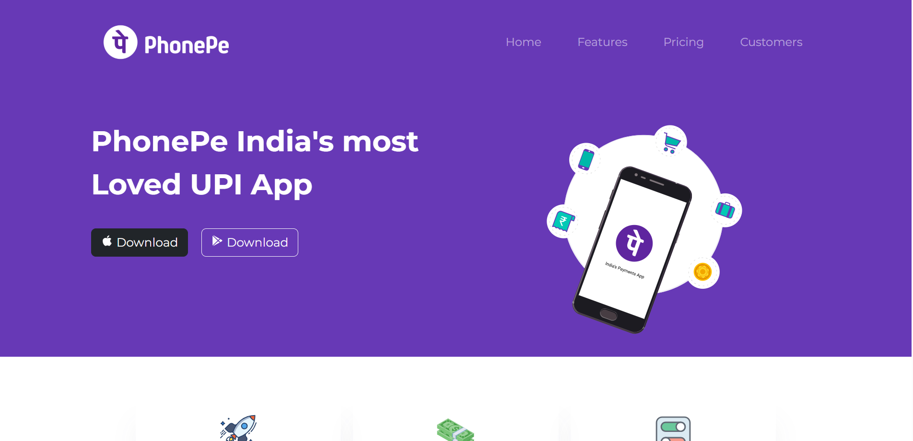
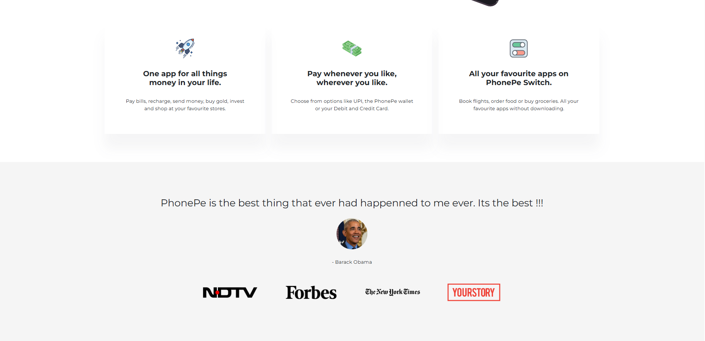

<h1 align="center">📱 PhonePe Clone - UPI App Landing Page</h1>

<p align="center">
  
  
  
  
</p>

---

## 🌐 Live Demo

🖥️ **Check it Live:**  
🔗 [Live Demo Link Coming Soon](#)

---

## 📝 Project Overview

This is a **responsive clone of the PhonePe UPI app's homepage** built using **HTML, CSS, and Bootstrap 5**. It includes smooth animations, interactive hover effects, and a clean, modern layout designed to closely replicate the user experience of India's most loved payments app.

> 🔥 *A sleek tribute to PhonePe — where design meets digital payments!*

---

## 🚀 Features

- ✨ Smooth animations on scroll, hover, and buttons
- 💻 Fully responsive layout for all screen sizes
- 📱 Floating iPhone hero image animation
- 🌈 Glowing download buttons with gradient swipe
- 🧠 Animated navbar links and section transitions
- 🎨 Clean UI inspired by PhonePe's official homepage

---

## 🛠️ Technologies Used

<p align="center">
  
  
  
  
</p>

---

## 🧪 Project Screenshots

<div align="center">
  
  
</div>

---

## 🚀 Getting Started Locally

### 1️⃣ Clone the Repository
```bash
git clone https://github.com/your-username/phonepe-clone-landing-page.git
```
